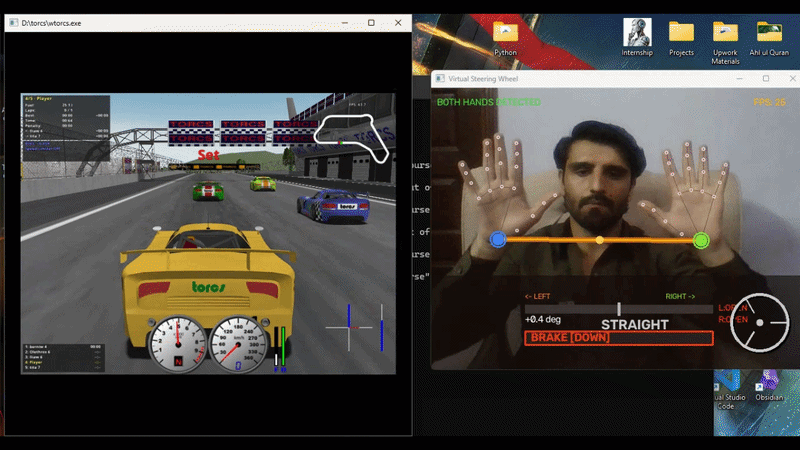

# 🎮 Virtual Steering Wheel

**Turn your bare hands into a steering wheel — no controller, no hardware, just a webcam.**


---

## 🕹️ What It Does

Hold your fists up like you're gripping a wheel, tilt to steer, and open your palms to brake — your webcam and a real-time hand-tracking model translate that into keyboard input, which means it works with **any game that uses arrow keys.** No mods, no APIs, no special integration — the game has no idea it's not a keyboard.

<p align="center">
  
  
  
</p>

---

## 🎬 Demo

<p align="center">
  
</p>

<p align="center"><i>🚧 Placeholder — replace with your own recording. See below for how.</i></p>

<details>
<summary><b>How to record and add your own demo GIF</b></summary>

1. Create an `assets/` folder in the repo root and record a short (10–15s) clip of yourself playing TORCS (or Chrome Dino) with the script running, ideally with the HUD window visible in a corner or side-by-side with the game.
2. **Windows:** use the built-in **Xbox Game Bar** (`Win + G`) or [ScreenToGif](https://www.screentogif.com/) to capture and export directly as a `.gif`.
   **macOS:** use `Cmd + Shift + 5` to record, then convert to GIF with [Gifski](https://gif.ski/) for small file size and clean quality.
3. Keep the file under ~10MB so it loads fast on GitHub — trim length or lower frame rate/resolution in Gifski/ScreenToGif if it's too big.
4. Save it as `assets/demo.gif` and this section will render it automatically — no other changes needed.
5. Optional: add a second GIF or a YouTube link for a longer, narrated walkthrough.

</details>

---

## ✋ Gesture Guide

| Gesture | Action | Keys Sent |
|:---:|:---|:---:|
| 👊 Both fists, level | Accelerate straight | `↑` |
| 👊 Both fists, tilt **left** | Accelerate + steer left | `↑` `←` |
| 👊 Both fists, tilt **right** | Accelerate + steer right | `↑` `→` |
| 🖐️ Both hands open, level | Brake | `↓` |
| 🖐️ Both hands open, tilt **left** | Brake + steer left | `↓` `←` |
| 🖐️ Both hands open, tilt **right** | Brake + steer right | `↓` `→` |
| 👊🖐️ Mixed (one fist, one open) | Neutral — no throttle | — |
| 🚫 No hands in frame | All keys released | — |

> 💡 Steering works independently of throttle/brake — you can turn while accelerating **or** braking.

---

## ⚙️ How It Works

1. **MediaPipe Hands** tracks 21 landmarks per hand in real time from your webcam feed.
2. The script computes the **tilt angle** between your two hands to determine steering direction, and counts **extended fingers** to classify each hand as a fist (throttle) or open palm (brake).
3. A **dead-zone + release-zone** system filters out jitter near center, so tiny hand tremors don't cause the car to twitch.
4. Detected gestures are converted into simulated key presses via `pynput` — held down for as long as the gesture is sustained, released the instant it changes.
5. A live HUD overlay shows your steering angle, throttle bar, and current key state, so you can see exactly what the game is receiving.

---

## 🧰 Requirements

- Python **3.9 – 3.12** (mediapipe does not yet fully support 3.13+)
- A webcam
- Windows or macOS

---

## 🚀 Installation

```bash
# Clone the repo
git clone https://github.com/zaibutman/virtual-steering-wheel.git
cd virtual-steering-wheel

# (Recommended) create a virtual environment
python -m venv venv
venv\Scripts\activate        # Windows
source venv/bin/activate     # macOS/Linux

# Install dependencies
pip install mediapipe opencv-python pynput numpy
```

> ⚠️ **mediapipe version note:** some recent releases (0.10.31+) ship without the `solutions` module due to an upstream packaging bug. If you hit `AttributeError: module 'mediapipe' has no attribute 'solutions'`, pin a working version:
> ```bash
> pip install mediapipe==0.10.14
> ```

---

## ▶️ Run It

```bash
python steering_wheel.py
```

Press **Q** in the camera window to quit at any time.

---

## 🖥️ Platform Setup

<details>
<summary><b>🍎 macOS</b></summary>

Built and originally tested on macOS (Apple M2). Grant camera access before running:

1. **System Settings → Privacy & Security → Camera**
2. Enable access for **Terminal** (or your Python launcher / IDE)
3. Re-run the script

</details>

<details>
<summary><b>🪟 Windows</b></summary>

Fully supported — the script auto-detects the OS and switches camera backends automatically. Just:

1. Install Python from [python.org](https://python.org) (3.9–3.12), checking **"Add python.exe to PATH"**
2. `pip install mediapipe opencv-python pynput numpy`
3. `python steering_wheel.py`
4. If the camera doesn't open, try changing `CAMERA_INDEX` at the top of the script between `0`, `1`, and `2` — built-in webcams are usually `0`
5. Accept the Windows camera-access prompt if one appears

</details>

---

## 🔧 Configuration

All tunable directly at the top of `steering_wheel.py`:

| Setting | Default | Description |
|---|:---:|---|
| `CAMERA_INDEX` | `0` | `0` = built-in webcam, `1`/`2` = external USB camera |
| `DEAD_ZONE_DEG` | `12` | Degrees of tilt ignored at center (prevents jitter) |
| `FLIP_CAMERA` | `True` | Mirror the feed (selfie view) |
| `GRACE_FRAMES` | `8` | Frames to wait before releasing keys when hands disappear |
| `OPEN_FINGER_THRESH` | `3` | Fingers that must be extended to count as an open hand |

---

## 🎯 Tested With

| Game | Notes |
|---|---|
| ✅ **TORCS** (The Open Racing Car Simulator) | Confirmed working — free, open-source, full 3D racing sim |
| ✅ Chrome Dino (`chrome://dino`) | Great for a quick 30-second demo, zero install |
| 🟡 Trackmania | Should work — pure arrow-key controls |
| 🟡 Hill Climb Racing (browser) | Should work — arrow-key gas/brake only |

*(✅ = confirmed by testing · 🟡 = expected to work, uses only arrow keys)*

Works with **any** game or app that accepts arrow-key input for movement — it just has to not require other keys (spacebar, enter) to actually start driving.

---

## 🩹 Troubleshooting

| Problem | Fix |
|---|---|
| `[ERROR] Cannot open camera` | Try `CAMERA_INDEX = 0`, `1`, or `2`; check another app isn't already using the camera |
| `AttributeError: module 'mediapipe' has no attribute 'solutions'` | Pin `pip install mediapipe==0.10.14` |
| Steering feels reversed | Toggle `FLIP_CAMERA = False` |
| Keys stuck after removing hands | Keep hands fully out of frame for ~8 frames (`GRACE_FRAMES`) |
| Brake not triggering | Spread fingers wider / fully extend at least 3 |
| Brake triggers too easily | Raise `OPEN_FINGER_THRESH` to `4` |
| Low FPS / laggy | Lower camera resolution in the script, or close other apps |

---

## 🗺️ Roadmap

- [ ] Reverse gesture (both fists pulled back)
- [ ] Configurable key bindings (WASD support)
- [ ] On-screen calibration wizard for dead zone
- [ ] Gamepad emulation via `vgamepad` for analog steering

---

## 📄 License

MIT — free to use, modify, and build on.

---

<p align="center">Built with 🖐️ + 🐍 — steer responsibly.</p>
